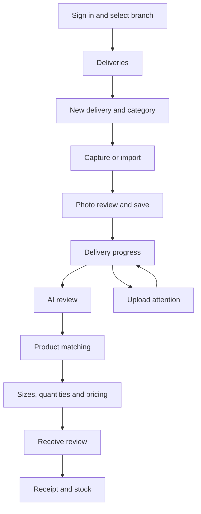

# K-Line Android screen flow and prototype scope

**Date:** 10 September 2026  
**Status:** Capture prototype built; A26 and S24+ reliability checks and emulator UI checks completed, with physical-phone screen/camera validation outstanding. See the [prototype report](android-prototype-report.md).  
**References:** [Proposal](android-app-proposal.md), [devices](android-device-assessment.md), [API contract](android-api-contract.md).

## 1. Product direction

Build a native Android companion for merchandise intake through POS receiving. Reuse the current backend and website. The pilot covers the Samsung S24+ on Android 14 and Samsung A26 on Android 16; prioritise responsive behaviour on the A26 and the owner's increased display scaling on the S24+.

Recommended pilot minimum: Android 14. Proposed compile/target SDK: 36, subject to compatible build-tool selection during scaffolding. No iPhone work, checkout system, payment integration or printer integration is included.

Treat devices as potentially shared until staff usage is confirmed. Every draft and queued image belongs to a specific account and branch. A branch switch changes the view, not the destination of previously saved work.

## 2. Navigation and screens

Bottom navigation: **Deliveries · Review · Stock**. Capture is the prominent action within Deliveries. A persistent branch control and upload-status indicator remain available. Account and settings are secondary controls.

| Screen | Main content and action | Required alternative states |
| --- | --- | --- |
| Sign in | Username/password; then authorised branch selection. | Offline first launch, expired session, deactivated account, invalid credentials. |
| Deliveries | Recent delivery cards, pending uploads, review counts; Capture action. | Empty branch, cached results with refresh time, no upload permission. |
| New delivery | Name and full category breadcrumb. Save a local draft immediately. | Cached category selection, unavailable category, missing reference data offline. |
| Capture | Camera, flash controls where supported, thumbnail strip, system photo picker. | Permission denied, camera unavailable, insufficient storage. |
| Photo review | Full image, filename, category, original caption evidence; Save to delivery. | Oversize/unsupported file, preparation failure, possible duplicate warning. |
| Delivery progress | Individual upload state; separate totals for photos, lots and units. | Offline, waiting for sign-in, retry scheduled, needs action, already received. |
| AI review | Image and proposed fields, evidence, uncertainty, size/count confirmation. | AI running, paused, uncertain paid attempt, stale edit, permission change. |
| Matching | Side-by-side photos, shared identity, differences and resulting variants. | No suggestion, incomplete evidence, stale preview, existing product candidate. |
| Quantities/pricing | Size grid, counts, retail prices and permitted cost fields. | Unconfirmed quantity, missing price, stale review, cost access restricted. |
| Receive review | Branch, products, variants, units and blockers; explicit Receive button. | Offline, changed revision, unknown receipt outcome, partial completion. |
| Receipt/stock | Confirmed receipt, current stock, photo-copy status and search. | Stock received but photo pending; cached stock; no inventory permission. |

On a phone, image and fields can switch between adjacent views without losing edits. On a wider screen, show them together. Preserve scroll position and selection after opening details.

## 3. Interaction and visual rules

- Product photos dominate the review screen; use a restrained K-Line palette and avoid filters that change apparent colour.
- Use at least 48 dp touch targets, scalable text, TalkBack labels, visible focus and sufficient contrast.
- Show the full category path, even when different branches of the tree use the same leaf name.
- Distinguish unsaved input, saved-on-phone data and server-confirmed data. Saving locally should feel immediate but must wait for durable persistence.
- Never use a green completion state for a merely submitted network request.
- Keep quantities labelled as units or pairs where the category requires it. A photo is not a quantity confirmation.
- Use subtle capture/completion haptics; respect accessibility and reduced-animation settings.
- Make errors actionable: “Sign in to continue”, “Waiting for a connection”, or “Already received; removing this completed upload from the queue”.

## 4. Transport state and merchandise state

Store these independently. A successfully uploaded photo may still need AI review, and a received item can remain in a stale device queue.

**Local transport:** preparing → saved → uploading → checking server → linking delivery → complete. Side states: waiting for network, waiting for sign-in, needs attention.

**Server merchandise:** draft / needs review → prepared → received, with cancellation and reconciliation states supplied by the API. AI batch and photo-handoff status are separate again.

Each upload stores a stable UUID, original file reference, prepared upload file reference, original account/branch/category/delivery, byte counts, local content hash and attempts. Do not generate a new UUID after an interruption. A content hash can help warn about duplicates, but cannot decide that two visually identical sellable units are the same lot.

During interrupted receipt, disable another Receive attempt until the server result has been reconciled. Never clear pending bytes because a request was merely sent. Clearing a completed queue row is distinct from deleting the original; establish a bounded retention policy before pilot release.

## 5. Offline and session behaviour

Allow capture and draft editing offline after a successful sign-in and cached branch/category setup. Mark offline edits as local proposals; applying them later requires a current server revision. Do not auto-merge conflicting merchandise edits.

Keep the original photo on the phone and prepare a deterministic upload derivative if needed to satisfy the current 5 MiB limit. Show the prepared version before submission when conversion materially affects legibility. Retain label and caption detail. Current server storage preserves the accepted upload bytes, not a larger phone original.

If a session expires, pause authenticated network work and request sign-in. Existing server-side AI jobs remain server-owned. On sign-out, stop that account's device workers and lock its drafts. Another user's login must not reveal or submit the previous user's queue. Final stock receipt requires a live connection.

## 6. First installable prototype

Include only the following in the first APK:

1. Sign-in and branch selection against an isolated test backend.
2. Cached category paths and locally saved delivery drafts.
3. Camera/import, review, app-owned image storage and a Room queue.
4. Stable-ID upload, delivery linking and readback recovery.
5. Upload progress and an attention screen, including already-received entries.

The broader AI/matching/receiving screens are specified above but belong to the next implementation increment. Do not fake a successful stock receipt to make the prototype look complete.

Use a separate development application ID, debug signing and obvious test-environment labelling. Do not import or clear the existing website's browser queue. Android app storage is separate from the browser; any later migration needs its own explicit flow.

## 7. Prototype acceptance matrix

| Scenario | Required result |
| --- | --- |
| Capture offline, then reopen | All saved drafts and images remain available under the correct account and branch. |
| Drop connection during upload | Stable-ID retry creates at most one intake for that queued entry. |
| Lose upload acknowledgement | Readback or idempotent retry resolves completion without a duplicate lot. |
| Upload succeeds; batch link fails | Preserve progress and retry the batch association without replacing the item. |
| Item received on website during resume | Confirm server state; leave delivery and stock unchanged; finish the stale queue entry. |
| Unrelated delivery conflict | Preserve the queued image and show the conflict; do not treat every 409 as success. |
| Session expires / different user signs in | Pause and retain the original user's work without cross-account access. |
| Lock, process death, reboot, force-stop then reopen | Recover persisted state; do not promise work while manually force-stopped. |
| Low storage or failed file copy | No “saved” message until both file and database state are durable. |
| Upgrade with pending uploads | Database migration and file references retain all queued work. |
| 50-photo batch with one invalid photo | Valid photos can progress; invalid image remains clearly actionable. |

Run all relevant scenarios on both real phones. Capture elapsed time, failures and recovery actions. Server-side tests must independently prove unique intake records and unchanged stock for upload-only scenarios.

## 8. Practical implementation backlog

| Order | Work | Completion evidence |
| --- | --- | --- |
| 1 | Verify toolchain and create Android project/module. | Reproducible debug build; empty shell installed on a pilot device. |
| 2 | Build navigation and persistent local models. | Draft survives process recreation and account switching remains isolated. |
| 3 | Implement capture/import and image preparation. | Both cameras tested; originals retained; upload derivatives fit server limits. |
| 4 | Implement typed API adapters and recovery worker. | Contract fixtures and interrupted-request cases pass. |
| 5 | Exercise the prototype on both phones. | Acceptance matrix recorded; no production merchandise changes. |
| 6 | Review prototype results before extending scope. | Concrete readiness report for AI review, matching and receiving implementation. |

The owner authorised the prototype phase. Implementation and current validation results are recorded in the prototype report. Complete the outstanding real-device checks before requesting approval to extend into AI, matching and receiving. Release signing, distribution and production rollout come later.
